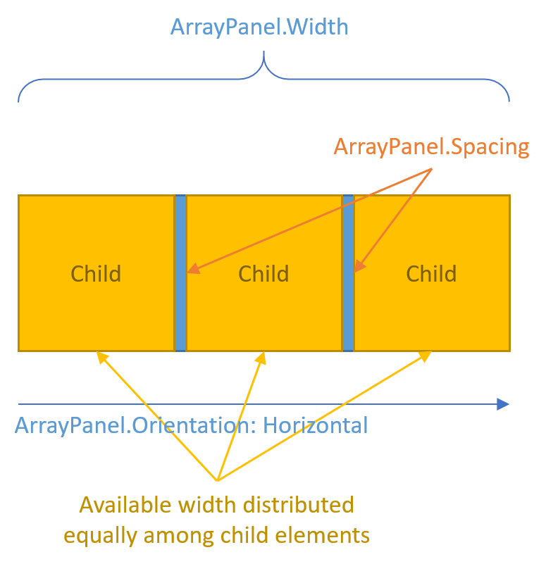

# ArrayPanel

The `ArrayPanel` control is a simple container that arranges child elements into a single line that can be oriented horizontally or vertically, where the full available space along the orientation axis is distributed equally among the child elements, with an optional spacing between them.

The layout behavior is similar to a `StackPanel` in that child elements are laid out in one line along the orientation axis, but instead of stacking child elements from one end to the other, `ArrayPanel` distributes child elements evenly across the orientation axis.

The following diagram illustrates the layout:

This is useful in scenarios where you want child elements sized equally, but the number of child elements is not known at design time which makes it hard to configure a `Grid` to achieve this layout. The `ArrayPanel` dynamically recalculates the layout as you add/remove child elements at runtime.

`ArrayPanel` inherits from `Panel` and adds two key properties:

- `Orientation` can be set to either `Horizontal` or `Vertical` to control the direction of layout (just like with `StackPanel`)
- `Spacing` can be set to add a fixed amount of space between child elements.

The `Spacing` property can be very useful to add spacing. It removes the need to configure margins/paddings on all child elements except the first/last elements to achieve the result of having a certain amount of space only *between* child elements.

The `ArrayPanel` control resides in the `IDeliverable.Controls.Uwp.Containers` package.