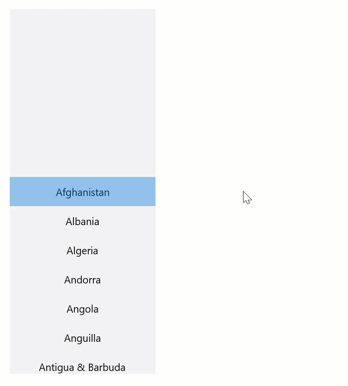

# ScrollSelector

The `ScrollSelector` control is an item selector control that is very similar to a `ListView`, but the currently selected item in the list is both chosen and visualized using the list view's current *scroll position* instead of by pressing/highlighting the item itself.

The `ScrollSelector` control resides in the `IDeliverable.Controls.Uwp.ScrollSelector` package.

## Behavior/interaction

The `ScrollSelector` displays a selection highlight in the center of the control. The item that is currently positioned underneath that selection highlight is the currently selected item.

To select an item, the user can use the following methods:

- Use mouse or touch interactions to scroll the item into place inside the selection highlight
- While the control has input focus, use the up/down keys to scroll/change the selection one item at a time.
- Use mouse or touch interactions to press one of the visible items; the pressed item then scrolls into the selection highlight.
- Use the visible up/down buttons at the top and bottom of the control to scroll/change the selection one item at a time; the up/down buttons are only visible when the pointer is inside the control.

The following animation illustrates the `ScrollSelector` control's behavior:

The behavior is very similar to how most picker controls work in iOS, and almost identical to how the individual selectors work in the flyout of the built-in `TimePicker` control in UWP.

## UX considerations

The concept of a scroll-based selector is most useful when you want allow the user to select a *composite* value, where components can be selected individually but the selected items combine to create the complete value. Selecting dates, times and time spans are good examples. In such cases, using multiple "traditional" list view controls presents a usability problem, in that the resulting composite value cannot easily be visualized as a unit (e.g. the complete date).

As such, the `ScrollSelector` control is most useful when two or more instances are combined, and its default rendering is designed with this scenario in mind, but it can also be used completely stand-alone if desired.

Another UX consideration is that the `ScrollSelector` control takes up a fair amount of vertical space, and its usability benefits diminish the smaller you make it; for this reason it may be best suited to flyouts, dialogs or other out-of-band pieces of UI. However, it can of course also be used inline like any other control, when desired.

## Relationship to LoopingSelector

The built-in `TimePicker` control and its `TimePickerFlyout` class use an internal selector implementation called `LoopingSelector` which is similar to `ScrollSelector` and which also supports infinite looping scrolling. However, the `LoopingSelector` class is internal to the framework and cannot be used from an application or from third-party custom controls. The `ScrollSelector` in this project implements the same functionality but without the looping behavior, and unlike `LoopingSelector`, it is public and can be used from applications or third-party custom controls.

## HorizontalContentAlignment property

The `ScrollSelector` control's default template supports  the `Control.HorizontalContentAlignment` property. Setting this property on the `ScrollSelector` control will affect the horizontal alignment of the items rendered in the list view.

## Header property

The `ScrollSelector` control also supports the `Control.Header` property. Set this property to any content (text or element) to render header content at the top of the control. The following image illustrates the control with the `Header` property set to the string `"Countries"`:

## No selection

The `ScrollSelector` supports having no selection (i.e. the `SelectedItem` being `null`). In this state, no selection highlight is visible.

This state is supported as the default initial state of the control if no item has been selected either programmatically or through user interaction, and can also be reached programmatically by setting the `SelectedItem` property to `null` in code.

There is no way for the user to interactively clear the selection.