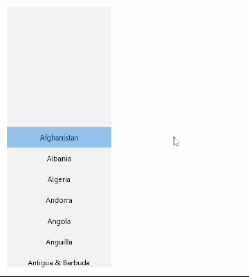
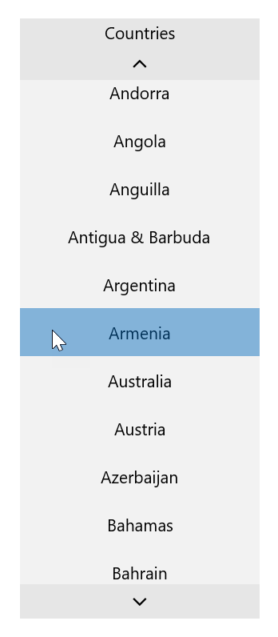

# ScrollSelector

The `ScrollSelector` control is an item selector control that is very similar to a `ListView`, but the currently selected item in the list is both chosen and visualized using the list view's current *scroll position* instead of by pressing/highlighting the item itself.

## Behavior/interaction

The `ScrollSelector` displays a selection highlight in the center of the control. The item that is currently positioned underneath that selection highlight is the currently selected item.

To select an item, the user can use the following methods:

- Use mouse or touch interactions to scroll the item into place inside the selection highlight
- Use the up/down keys to scroll/change the selection one item at a time.
- Use mouse or touch interactions to press one of the visible items; the pressed item then scrolls into the selection highlight.
- Use the visible up/down buttons at the top and bottom of the control to scroll/change the selection one item at a time; the up/down buttons are only visible when the pointer is inside the control.

The following animation illustrates the `ScrollSelector` control's behavior:

The behavior is very similar to how most picker controls work in iOS, and almost identical to how the flyout of the built-in `TimePicker` control works in UWP.

## An alternative to LoopingSelector

The `TimePicker` control and its `TimePickerFlyout` class use an internal selector implementation called `LoopingSelector` which also supports infinite looping scrolling. However, the `LoopingSelector` class is internal to the framework and cannot be used from an application or from third-party custom controls. The `ScrollSelector` in this project implements the same functionality but without the looping behavior.

## HorizontalContentAlignment property

The `ScrollSelector` supports setting the `HorizontalContentAlignment` property. This property will affect the horizontal alignment of the items rendered in the list view.

## Header property

The `ScrollSelector` control also supports the `Header` property. Set this property to any content (text or element) to render header content at the top of the control. The following image illustrates the control with the `Header` property set to the string "Countries":

## No selection

The `ScrollSelector` supports having no selection (i.e. the `SelectedItem` being `null`). In this state, no selection highlight is visible.

This state is supported as the default initial state of the control if no item has been selected either programmatically or through user interaction, and can also be reached programmatically by setting the `SelectedItem` property to `null` in code.

There is no way for the user to interactively clear the selection.